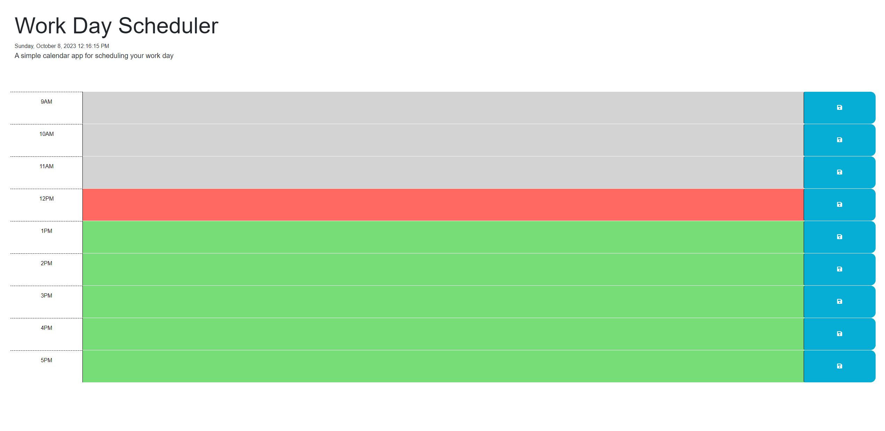

## Daily Organizer
This website was created to help the user create task and store them in timed sections. The website also deploys a up to date time using dayJS. The website has local storage capabilities using JSON and jQuery. 
The user can come back to the application at a later time after closing or resetting their browser and the information will be saved.

## Link to Website

## Screenshot of Deployed Website

## Credit 
All techniques used in this website are derived from SMU Coding Boot Camp, Online Internet Resources and reddit.

## Update
